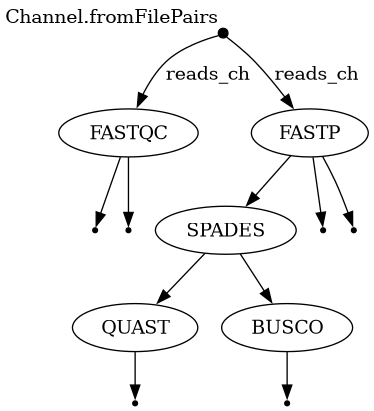

# Nextflow Genome Assembly Pipeline

A modular, containerized **Nextflow DSL2** pipeline for **de novo bacterial genome assembly** from paired-end Illumina sequencing reads. The pipeline automates raw read quality assessment, adapter trimming, genome assembly, and assembly quality/completeness evaluation using industry-standard bioinformatics tools.

[](https://www.nextflow.io/)
[](https://www.docker.com/)
[](LICENSE)

---

## Overview

Genome assembly quality is only as reliable as the QC and validation steps surrounding it. This pipeline provides a reproducible, end-to-end workflow that takes raw paired-end reads through trimming, assembly, and two complementary layers of assembly evaluation — contiguity/structural metrics (QUAST) and biological completeness (BUSCO) — with minimal manual intervention.

### Pipeline DAG

<p align="center">
  
</p>

<p align="center"><em>Directed acyclic graph generated by Nextflow, showing channel fan-out from raw reads into FastQC/Fastp, and downstream fan-out from SPAdes into QUAST/BUSCO.</em></p>

### Workflow Summary

```text
Paired-end FASTQ
       │
       ▼
    FASTQC  ──────► Raw read quality report
       │
       ▼
     FASTP  ──────► Adapter trimming & quality filtering
       │
       ▼
    SPAdes  ──────► De novo genome assembly
       │
       ├────────► QUAST  (assembly quality metrics)
       │
       └────────► BUSCO  (genome completeness)
```

---

## Features

- **Modular DSL2 architecture** — each tool is an independent, reusable process module
- **Containerized execution** — all tools run via Docker for full reproducibility
- **Resumable runs** — Nextflow's built-in caching (`-resume`) avoids redundant recomputation
- **Parallel execution** — independent processes (QUAST/BUSCO) run concurrently
- **Pre-assembly quality control** — raw read assessment before any processing
- **Dual assembly validation** — structural metrics and completeness assessed independently

---

## Tools Used

| Tool | Version target | Purpose |
|------|-----------------|---------|
| [FastQC](https://www.bioinformatics.babraham.ac.uk/projects/fastqc/) | latest | Raw read quality assessment |
| [Fastp](https://github.com/OpenGene/fastp) | latest | Adapter trimming and quality filtering |
| [SPAdes](https://github.com/ablab/spades) | latest | De novo genome assembly |
| [QUAST](https://github.com/ablab/quast) | latest | Assembly quality evaluation |
| [BUSCO](https://busco.ezlab.org/) | latest | Genome completeness assessment |

---

## Directory Structure

```text
Nextflow-Genome-Assembly-Pipeline/
│
├── modules/
│   ├── fastqc.nf
│   ├── fastp_trim.nf
│   ├── spades_assembly.nf
│   ├── quast.nf
│   └── busco.nf
│
├── Data/
│   └── raw_reads/
│
├── results/
│
├── main.nf
├── nextflow.config
├── .gitignore
└── README.md
```

---

## Requirements

- [Nextflow](https://www.nextflow.io/) ≥ 24.x
- [Docker](https://www.docker.com/) (with the daemon running)
- Paired-end Illumina FASTQ files

---

## Installation

```bash
git clone https://github.com/rahuls472/Nextflow-Genome-Assembly-Pipeline.git
cd Nextflow-Genome-Assembly-Pipeline
```

Ensure Nextflow and Docker are installed and available on your `PATH`:

```bash
nextflow -version
docker --version
```

---

## Configuration

Pipeline parameters are defined in `nextflow.config` and can be overridden via the command line.

```groovy
params {
    raw_reads     = "Data/raw_reads/*_{1,2}.fastq"
    busco_lineage = "bacteria_odb10"
}

docker {
    enabled = true
}
```

| Parameter | Description | Default |
|-----------|--------------|---------|
| `raw_reads` | Glob pattern for paired-end FASTQ input | `Data/raw_reads/*_{1,2}.fastq` |
| `busco_lineage` | BUSCO lineage dataset used for completeness assessment | `bacteria_odb10` |

---

## Input

Paired-end Illumina FASTQ files, named so that read pairs share a common prefix.

```text
Data/raw_reads/
├── sample_1.fastq
└── sample_2.fastq
```

---

## Usage

Run the pipeline with default parameters:

```bash
nextflow run main.nf
```

Override parameters at runtime:

```bash
nextflow run main.nf --raw_reads "Data/raw_reads/*_{1,2}.fastq" --busco_lineage bacteria_odb10
```

Resume an interrupted or modified run using cached results:

```bash
nextflow run main.nf -resume
```

---

## Output

```text
results/
├── fastqc/           # Raw read quality reports
├── fastp/             # Trimmed reads and HTML/JSON reports
├── spades_results/    # Genome assembly output
├── quast_results/      # Assembly evaluation report
└── busco_results/      # Completeness assessment report
```

### FastQC
Raw sequencing quality reports for input reads.

<p align="center">
  
</p>

### Fastp
- Adapter-trimmed, quality-filtered reads
- HTML report
- JSON report

<p align="center">
  
</p>

### SPAdes
- Final genome assembly (`contigs.fasta`)

### QUAST
- Number of contigs
- Total genome size
- N50
- Largest contig length
- GC content

<p align="center">
  
</p>

### BUSCO
- Overall genome completeness
- Complete BUSCOs (single-copy and duplicated)
- Fragmented BUSCOs
- Missing BUSCOs

**Example output:**
```text
C:100.0%[S:100.0%,D:0.0%],F:0.0%,M:0.0%,n:124
```

<p align="center">
  
</p>

> **Note:** The screenshots above are placeholders. Add your own report images to `docs/images/` using the filenames referenced (`fastqc_report.png`, `fastp_report.png`, `quast_report.png`, `busco_summary.png`) and they'll render automatically on GitHub.

---

## Roadmap

- [ ] MultiQC integration for aggregated reporting
- [ ] Prokka genome annotation
- [ ] AMRFinderPlus (antimicrobial resistance gene detection)
- [ ] PlasmidFinder (plasmid identification)
- [ ] MLST (multi-locus sequence typing)
- [ ] Snakemake equivalent workflow
- [ ] CI/CD testing via GitHub Actions

---

## Contributing

Contributions, issues, and feature requests are welcome. Feel free to open an issue or submit a pull request.

---

## Author

**Rahul Kumar Singh**
M.Sc. Bioinformatics
GitHub: [@rahuls472](https://github.com/rahuls472)

---

## License

This project is licensed under the [MIT License](LICENSE).
